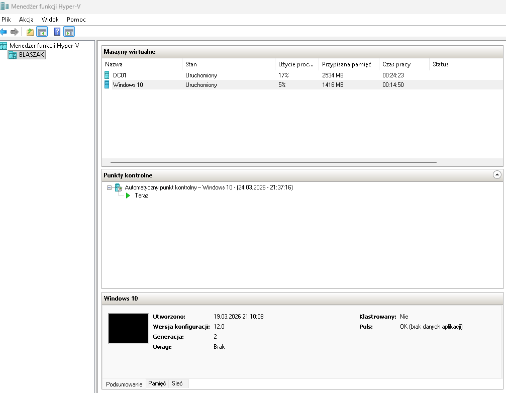
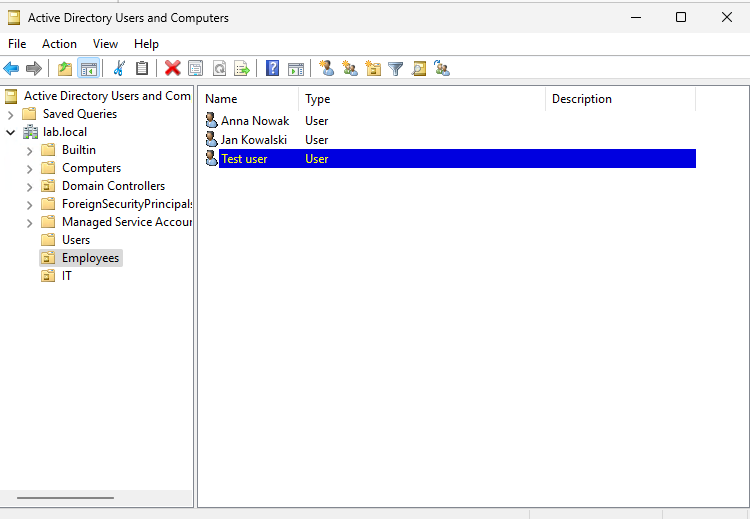
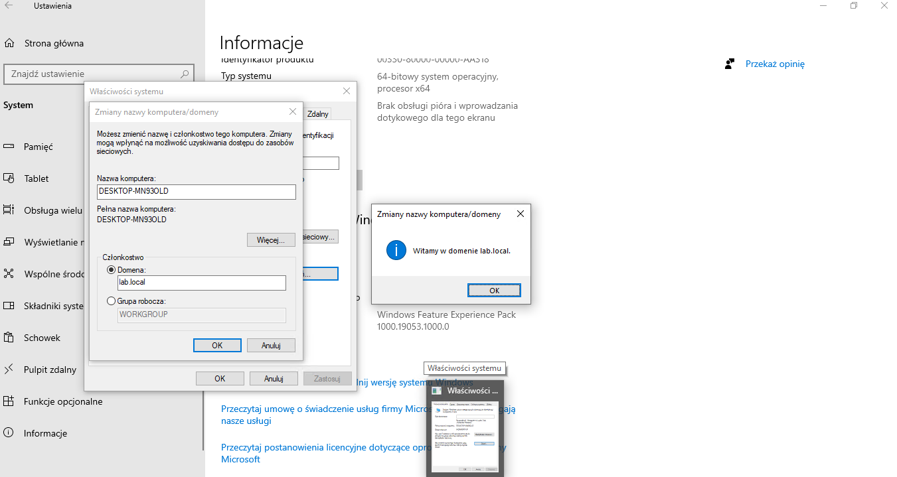
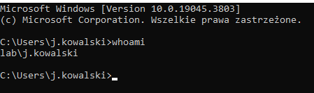
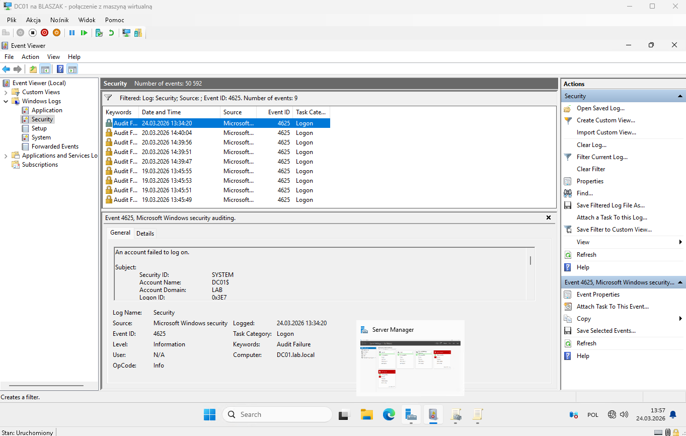

# Active Directory Lab + Log Analysis

## 📌 Overview
This project demonstrates building a basic Active Directory environment and analyzing authentication logs for security monitoring.

## 🛠️ Lab Setup
- Windows Server (Domain Controller)
- Windows 10 (Client)
- Hyper-V environment
- Domain: lab.local

## ⚙️ Configuration
- Created domain: lab.local
- Configured DNS and static IP addressing
- Joined Windows 10 client to domain
- Created users and organizational units in Active Directory

## 👤 User Management
- Created domain user: j.kowalski
- Assigned basic permissions
- Tested domain login

## 🔐 Security Monitoring
- Configured Advanced Audit Policies:
  - Logon events (Success/Failure)
  - Credential validation
- Generated failed login attempts

## 📊 Log Analysis
Analyzed Windows Security logs in Event Viewer:

- **Event ID 4624** – Successful logon  
- **Event ID 4625** – Failed logon  

Example findings:
- Logon Type 10 (Remote/Network logon)
- Detection of failed authentication attempts
- Identification of invalid login attempts (NULL SID cases)

## 📸 Screenshots

### Lab setup

### Active Directory users

### Domain join

### User login

### Failed logon (Event 4625)

## 🚀 Skills Demonstrated
- Active Directory configuration
- Windows Server administration
- Network configuration (DNS, IP)
- Log analysis & security monitoring
- Troubleshooting (GPO, authentication issues)
