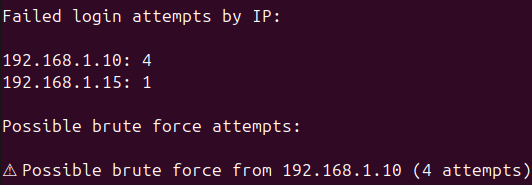

# Log Analysis Tool (Python)

Simple Python tool for analyzing SSH authentication logs and detecting repeated failed login attempts that may indicate brute-force attacks.

## Features

- Parses authentication log files
- Extracts source IP addresses from failed login attempts
- Counts login attempts per IP address
- Detects suspicious activity (possible brute-force attacks)

## Technologies Used

- Python
- Regex log parsing
- Collections (Counter)

## Example Log Entry

```
Jun 10 10:15:32 server sshd[1234]: Failed password for root from 192.168.1.10 port 22 ssh2
```

## Example Output

```
Failed login attempts by IP:

192.168.1.10: 4
192.168.1.15: 1

Possible brute force attempts:

⚠ Possible brute force from 192.168.1.10 (5 attempts)
```

## Usage

Run the script and provide the log file as an argument:

```
python log_analyzer.py auth.log
```

## Example

```
python log_analyzer.py auth.log
```

## Screenshot

Example output from the tool:



## Purpose

This project demonstrates basic log analysis techniques commonly used in Security Operations Centers (SOC), including detection of repeated failed login attempts that may indicate brute-force attacks.
