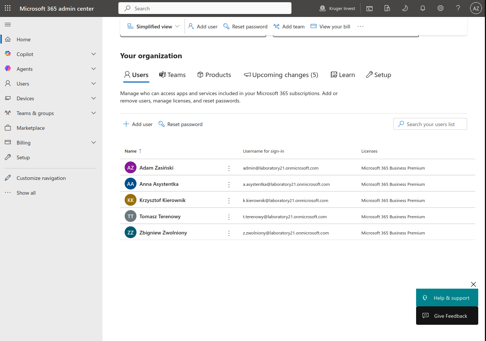
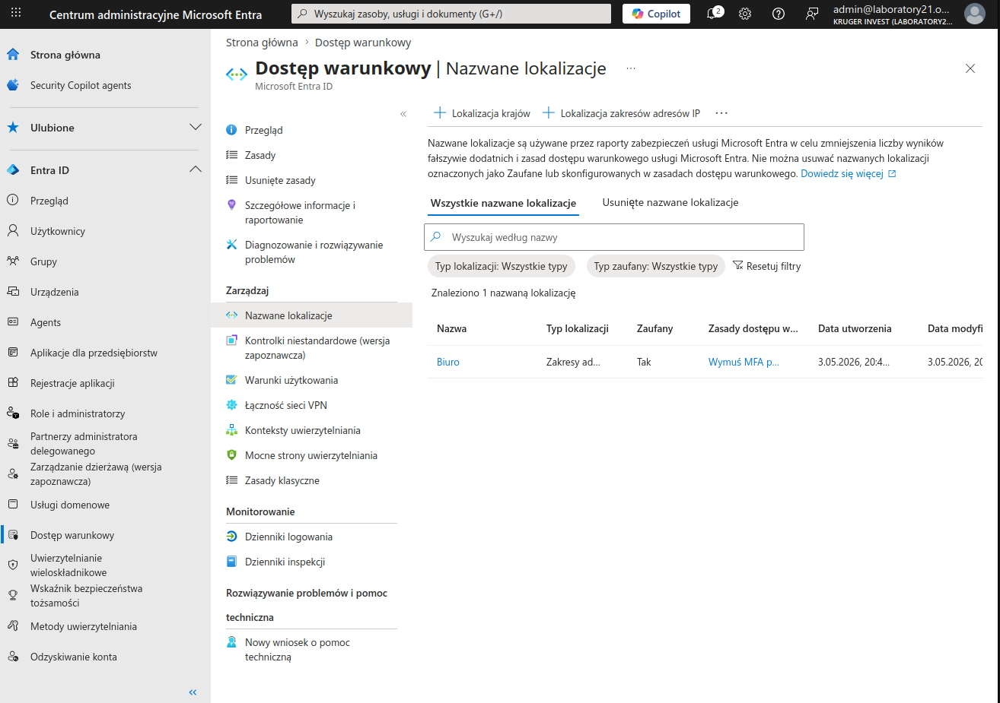
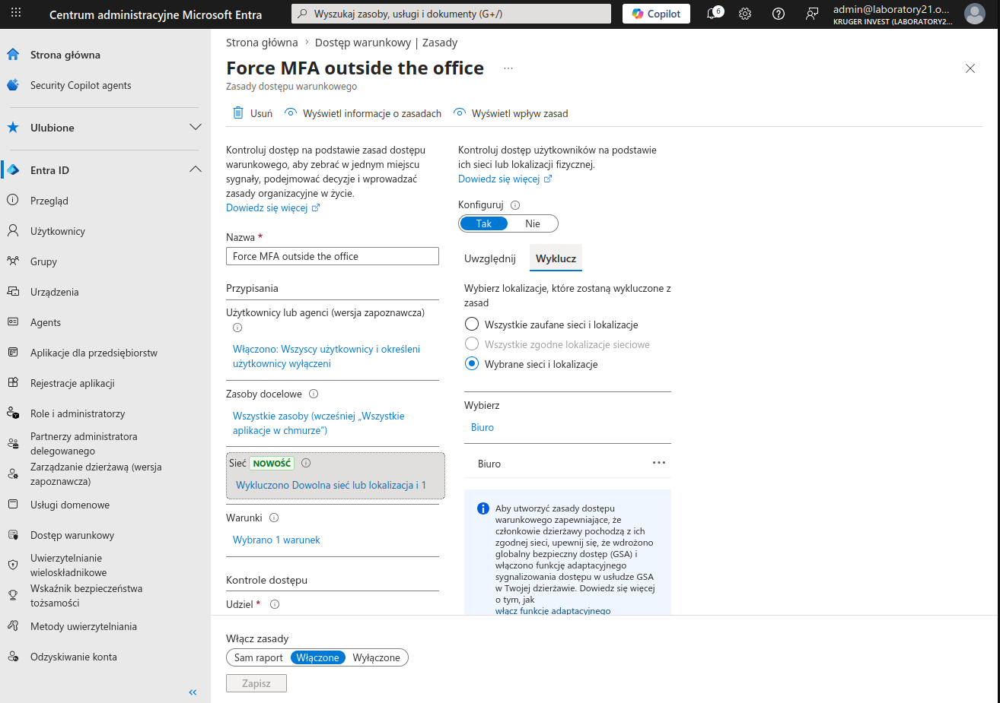
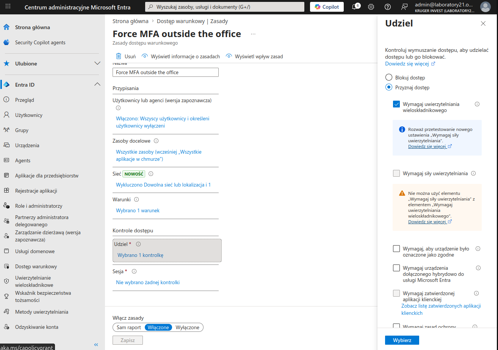
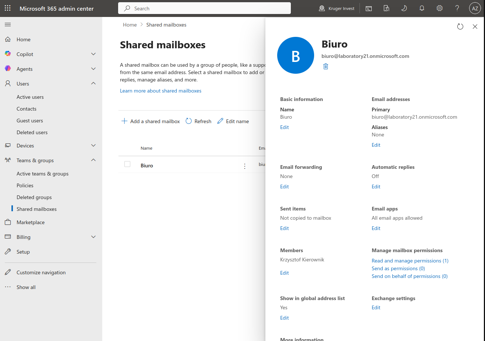
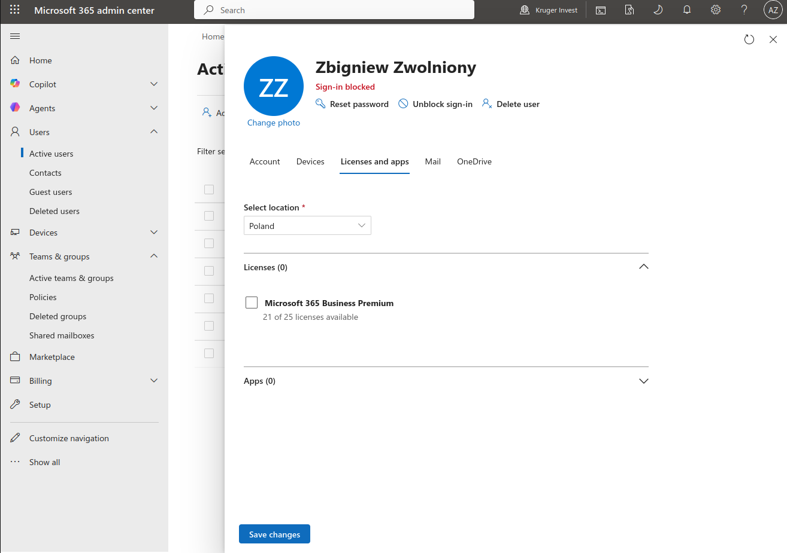

# Microsoft 365 Cloud Administration & Security Lab

## Objective
This project demonstrates professional administration of a Microsoft 365 hybrid-ready environment. It focuses on Identity and Access Management (IAM), security automation through Conditional Access, and standard administrative workflows like shared resource management and secure user offboarding.

### Technologies Used
* **Microsoft 365 Admin Center** (SaaS Administration)
* **Microsoft Entra ID** (Identity & Security)
* **Exchange Online** (Mailflow & Resource Management)

## Project Scenarios & Implementation

### 1. Identity & License Management
Established a cloud directory with a structured user hierarchy. Assigned **Microsoft 365 Business Premium** licenses to enable advanced security features like Intune and Conditional Access.

### 2. Zero Trust Security: Conditional Access & MFA
Implemented a "Zero Trust" security model by configuring **Conditional Access** policies. 
* **Scenario:** Users are required to use MFA only when accessing resources from outside the trusted office network.
* **Implementation:** Defined "Named Locations" based on public IP ranges and created a global policy requiring MFA with a specific exclusion for the trusted "Office" location.

### 3. Shared Resource Administration (Exchange Online)
Configured a **Shared Mailbox** for the "Office" department. This ensures centralized communication management and allows specific team members (e.g., Krzysztof Kierownik) to "Read and Manage" or "Send As" without needing additional licenses.

### 4. Secure Offboarding Workflow
Demonstrated the standard IT Support procedure for departing employees ("Zbigniew Zwolniony"). 
* **Action taken:** Immediate sign-in block, session revocation, password reset, and license reclamation to ensure data integrity and cost optimization.

